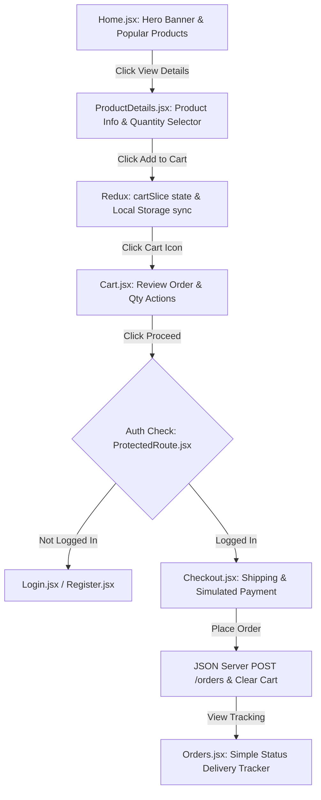

# GiftCorner – Project Architecture & Viva Preparation Guide

This document provides a comprehensive, pin-to-pin explanation of the **GiftCorner** e-commerce platform. It details the complete project flow, technology stack choices, key codebase components, and provides structured answers to all **Viva Questions** to help you ace your project review.

---

## 1. 🔄 Complete Project Flow

The application behaves as a standard, high-performance, single-page e-commerce app with two distinct user flows: **Shopper Flow** and **Administrator Flow**.

### A. The Shopper Flow (User Journey)


1. **Home Page (`Home.jsx`):**
   * Displays the brand hero section and queries the JSON Server for the product catalog.
   * Pulls the first 3 items dynamically to showcase under "Popular Creations".
   * Swapping elements on hover provides micro-interactions for a premium feel.
2. **Product Catalog (`Products.jsx`):**
   * Displays all 12 items.
   * Direct filters let users filter by Category (e.g. *Home Decor*, *Keepsakes*) and Brand (e.g. *Crafted Memories*), adjust pricing via a sliding range bar, and select interactive minimum star-rating pills.
3. **Product Details View (`ProductDetails.jsx`):**
   * Displays the item image, category, title, description, and star-rating.
   * Users adjust quantity using standard count buttons (`-` and `+`) and click **Add to Shopping Cart**, triggering a Redux action that slides in a "success toast" message.
4. **Shopping Cart (`Cart.jsx` & `CartItem.jsx`):**
   * Lists items.
   * Computes subtotal, dynamic shipping fees (free above ₹1,500, otherwise ₹99), and total value in Indian Rupees (INR).
   * Modifying quantities instantly updates the Redux store and writes directly to Local Storage for session persistence.
5. **Route Guard Lock (`ProtectedRoute.jsx`):**
   * If a user tries to access `/cart`, `/wishlist`, `/orders`, or `/checkout` without logging in, the route guard locks access and redirects them to `/login`.
6. **Authentication (`Login.jsx` & `Register.jsx`):**
   * Registering calls the database to verify email uniqueness and inserts the user record.
   * Logging in queries user records and saves user session credentials (excluding passwords) into Local Storage (`giftcorner_user`).
7. **Secure Checkout (`Checkout.jsx`):**
   * Renders shipping details and billing inputs.
   * Validates inputs, posts order data containing items, total price, and timestamps to `/orders` on the server, clears the Redux cart, and shows a mock email confirmation notification.
8. **Order Tracking (`Orders.jsx`):**
   * Pulls previous checkouts matching the logged-in user ID.
   * Lists dates, reference IDs, prices, and standard statuses (`Delivered` if 48+ hours have passed, else `In Transit`).

### B. The Administrator Flow (Admin Journey)
1. **Admin Entrance:** Logging in with `admin@giftcorner.com` (password: `admin123`) identifies the role as `admin` and redirects the user to `/admin`.
2. **Admin Dashboard (`AdminDashboard.jsx`):**
   * Renders a dashboard containing an interactive table of all catalog products (Image, Name, Category, Price, and Stock).
   * **CREATE:** Clicking "Add New Gift" opens a modal form. Submitting posts a new product payload via Axios to `/products`.
   * **UPDATE:** Clicking "Edit" opens the modal filled with existing database attributes. Submitting executes an Axios PUT request to update the product.
   * **DELETE:** Clicking "Delete" prompts a warning. Confirming sends an Axios DELETE request, immediately updating the product list via Redux thunks.

---

## 2. 💻 Technology Stack & Structural Advantages

| Technology | Role in Project | Why Used | Key Advantage |
| :--- | :--- | :--- | :--- |
| **React JS (Vite)** | Frontend Library | Component-driven architecture allows building independent, reusable UI views with hot-reloads. | High UI rendering speed via Virtual DOM; extremely fast bundling speeds with Vite. |
| **Redux Toolkit** | State Management | Manages dynamic, frequently changing global states (Cart catalog and Products CRUD). | Predictable state mutations; centralized slice logic; automatic action-reducer generation. |
| **Context API** | Authentication | Manages static user login profiles and token settings across the entire app. | Zero overhead boilerplate; perfect for global states that update infrequently (Auth, Themes). |
| **Axios** | HTTP Client | Performs asynchronous network calls (GET, POST, PUT, DELETE) to our JSON mock API. | Automatic JSON serialization; simple request/response structures; cleaner syntax than `fetch`. |
| **Local Storage** | Session Persistence | Saves the shopping cart items and user login profiles across browser refreshes. | Synchronous, easy-to-use client-side storage that survives browser restarts without backend hits. |
| **React Router DOM** | Client Routing | Handles page navigation, query parameters, and protected admin/user route gates. | Enforces clean URLs; dynamic route parameters (e.g. `/product/:id`) with lazy hooks. |
| **JSON Server** | Fake REST API | Simulates a backend database using a static JSON file (`db.json`) on port `5000`. | Rapid prototyping; behaves exactly like a real RESTful API with full CRUD support. |

---

## 3. 📂 Codebase Key Elements Explained

### A. Axios Network Configuration (`src/services/api.js`)
Configures a centralized Axios instance to make API calls simpler and cleaner:
```javascript
import axios from 'axios';

const API_URL = 'http://localhost:5000';

const api = axios.create({
  baseURL: API_URL,
  headers: {
    'Content-Type': 'application/json',
  },
});

export const productAPI = {
  getAll: () => api.get('/products'),
  getById: (id) => api.get(`/products/${id}`),
  create: (data) => api.post('/products', data),
  update: (id, data) => api.put(`/products/${id}`, data),
  delete: (id) => api.delete(`/products/${id}`),
};
```
* **Why it matters:** Centralizes the base URL. If the server port or domain changes, we only need to edit one line.

### B. Context Authentication (`src/context/AuthContext.jsx`)
Exposes state and login/logout thunks globally:
```javascript
export const AuthProvider = ({ children }) => {
  const [user, setUser] = useState(() => {
    const storedUser = localStorage.getItem('giftcorner_user');
    return storedUser ? JSON.parse(storedUser) : null;
  });

  const login = async (email, password) => {
    const response = await authAPI.getUsers();
    const foundUser = response.data.find(u => u.email === email && u.password === password);
    if (foundUser) {
      const safeUser = { ...foundUser };
      delete safeUser.password; // Exclude passwords for safety
      localStorage.setItem('giftcorner_user', JSON.stringify(safeUser));
      setUser(safeUser);
      return safeUser;
    }
    throw new Error('Invalid email or password');
  };
  // ... register and logout thunks
};
```
* **Why it matters:** Provides authentication state to lock/unlock routes before pages render.

### C. Redux Store & Cart Slice (`src/redux/cartSlice.js`)
Manages standard e-commerce state:
```javascript
const cartSlice = createSlice({
  name: 'cart',
  initialState: { items: loadCartFromStorage() },
  reducers: {
    addToCart: (state, action) => {
      const { id, title, price, image, quantity = 1 } = action.payload;
      const cartItemId = id.toString();
      const existingItem = state.items.find(item => item.cartItemId === cartItemId);
      if (existingItem) {
        existingItem.quantity += quantity;
      } else {
        state.items.push({ cartItemId, id, title, price, image, quantity });
      }
      saveCartToStorage(state.items);
    },
    // ... updateQuantity, removeFromCart, clearCart
  }
});
```
* **Why it matters:** Keeps the cart items, badge counts, and prices synchronized across pages.

---

## 4. 🎤 VIVA QUESTIONS & DETAILED ANSWERS

### 📚 SECTION 1: REACT JS

#### Q1: What is React?
**Answer:**
React is an open-source frontend JavaScript library developed by Meta (Facebook) for building user interfaces, specifically for Single Page Applications (SPAs).
* **Key Features:**
  * **Component-Based:** The UI is split into small, reusable, isolated pieces of code called components.
  * **Declarative:** We describe *what* the UI should look like based on the current state, and React handles updating the DOM.
  * **Unidirectional Data Flow:** Data flows down from parent components to child components via `props`.

#### Q2: What is the Virtual DOM?
**Answer:**
The Virtual DOM (VDOM) is a lightweight, in-memory representation of the real HTML DOM.
* **How it works:**
  1. Whenever the state of a component changes, React creates a new Virtual DOM tree representing the updated UI.
  2. **Diffing:** React compares this new VDOM tree with the previous VDOM tree using a diffing algorithm.
  3. **Reconciliation:** React calculates the minimum number of changes needed and updates *only* those specific parts in the real DOM (patching), rather than reloading the entire webpage. This is much faster than direct DOM manipulation.

#### Q3: What are Hooks?
**Answer:**
Hooks are built-in functions introduced in React 16.8 that allow functional components to use state and lifecycle features without writing class components.
* **Common Hooks used in this project:**
  * `useState`: Declares state variables in functional components (e.g. `quantity` on the details page).
  * `useEffect`: Handles side-effects like fetching data from JSON-server when the component mounts.
  * `useContext`: Accesses values from React Context (e.g. reading current logged-in user data from `AuthContext`).

---

### 📚 SECTION 2: REDUX TOOLKIT

#### Q1: What is Redux Toolkit (RTK)?
**Answer:**
Redux Toolkit is the modern, official recommendation for writing Redux code. It simplifies state management by eliminating boilerplate code (like action creators and constants) and comes pre-configured with standard middle-wares like Redux Thunk.
* **Why we use it:** Traditional Redux required writing separate actions, reducers, and constants files. RTK simplifies this by grouping them into "slices".

#### Q2: What is a Slice?
**Answer:**
A Slice is a collection of Redux reducer logic and actions for a single feature of the app. It is created using the `createSlice` method.
* **Our Project Slices:**
  * `cartSlice.js`: Manages the array of items added to the cart, handles quantity increments, and clears the cart on checkout.
  * `productSlice.js`: Manages fetching products from the API and executing admin CRUD thunks.

#### Q3: What is the Store?
**Answer:**
The Redux Store is the centralized container that holds the global state of the entire application.
* **Role:**
  * Components dispatch actions to the store.
  * Reducers inside slices listen to these actions and update the store's state.
  * Components select slice data using hooks like `useSelector` to re-render when state changes.

---

### 📚 SECTION 3: CONTEXT API

#### Q1: Why Context API?
**Answer:**
Context API is a built-in React feature that allows passing data down the component tree without manually passing props through every level (avoiding **Prop Drilling**).
* **When to use:** Ideal for global data that changes infrequently, such as theme configurations, language settings, and user authentication status.

#### Q2: What is the difference between Redux and Context API?
**Answer:**
* **Redux:**
  * Designed for high-frequency state updates (like additions to a shopping cart or dashboard filters).
  * Uses a single centralized store with actions, dispatchers, and middleware.
  * Optimized to prevent unnecessary component re-renders.
* **Context API:**
  * Designed for low-frequency state updates (like authentication logins/logouts).
  * Built directly into React, requiring no extra library downloads.
  * Whenever the context value changes, all components consuming that context are forced to re-render, making it less optimal for highly dynamic data.

---

### 📚 SECTION 4: AXIOS

#### Q1: Why Axios?
**Answer:**
Axios is a promise-based HTTP client used to send requests to backend endpoints.
* **Advantages over native `fetch`:**
  * Automatically serializes data to JSON format.
  * Clearer syntax (e.g. `axios.post(url, data)` instead of setting body strings and headers manually).
  * Better error handling (intercepts status code errors automatically).
  * Supports request/response interceptors to easily log network traffic.

#### Q2: What are CRUD Operations?
**Answer:**
CRUD stands for **Create, Read, Update, and Delete**. In this project, they are mapped to HTTP methods via Axios:
1. **CREATE (POST):** Admin adds a new product record using `axios.post('/products', productData)`.
2. **READ (GET):** Users fetch the product catalog using `axios.get('/products')`.
3. **UPDATE (PUT):** Admin modifies a product's price or stock using `axios.put('/products/id', updatedData)`.
4. **DELETE (DELETE):** Admin removes an item from inventory using `axios.delete('/products/id')`.

---

### 📚 SECTION 5: LOCAL STORAGE

#### Q1: What is the difference between Session Storage and Local Storage?
**Answer:**
* **Local Storage:**
  * Data stored in Local Storage has **no expiration time**.
  * The data remains stored even after the browser window or tab is closed, and even when the computer is restarted.
  * *Used in this project for:* Cart item persistence (`giftcorner_cart`) and user session states (`giftcorner_user`).
* **Session Storage:**
  * Data stored in Session Storage is cleared as soon as the **page session ends** (when the specific browser tab or window is closed).
  * Data is not shared between different browser tabs, even if they are visiting the same URL.
